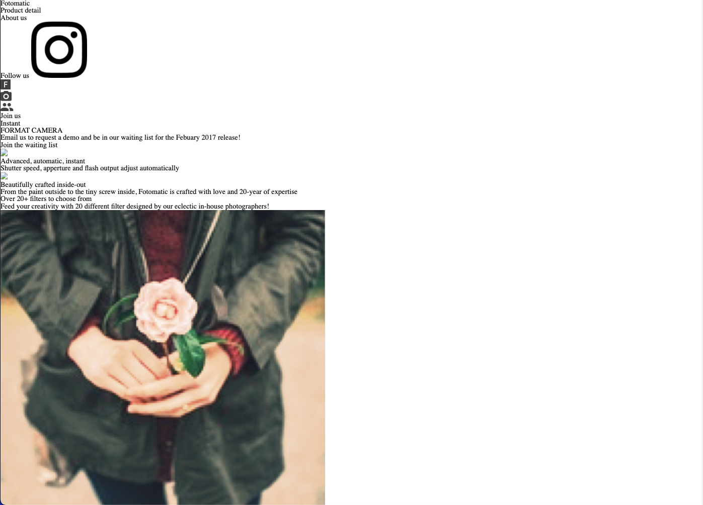

# Fotomatic Debugging 

## Description

In this project I had to fix a broken version of a responsive website. I had to update it, look and work exactly as the specs do. Used DevChrome Tools.

## Screenshots

This was the beginning of the project.

Here was the specs page for reference

### Finish Product 

The finished product

